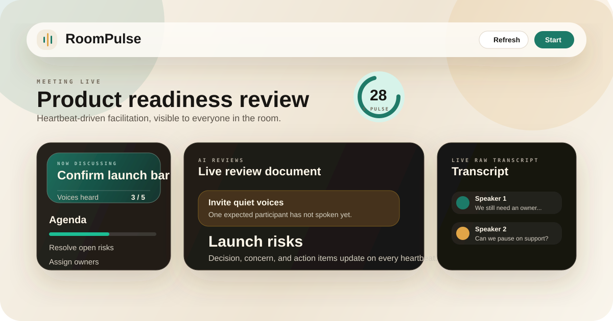
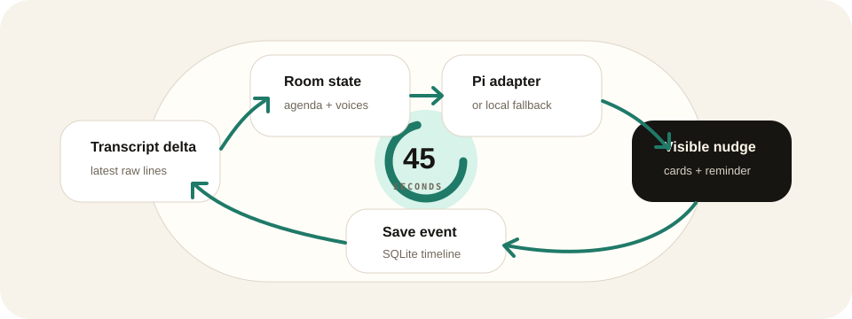
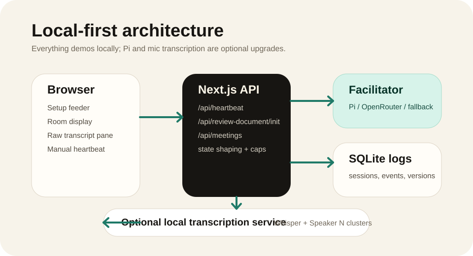

# RoomPulse

RoomPulse is a local-first, room-visible AI meeting facilitator. It is built for
a shared display in the room: live transcript on one side, heartbeat-driven
facilitation in the center, and agenda/participation nudges that everyone can
see.



## Fast Demo

No Pi auth, microphone, or transcription service is required for the fastest
demo.

```bash
npm install
npm run demo
```

Open `http://localhost:3000`, click **Launch live demo**, then use
**Run heartbeat** whenever you want the facilitator to review the latest room
state. `npm run demo` forces deterministic local fallback so the demo works even
on a machine with no Pi credentials.

## What RoomPulse Shows

| Area | What the room sees |
| --- | --- |
| Heartbeat | Countdown, manual trigger, current facilitator source, and the latest room-facing reminder. |
| Review document | A versioned markdown review that the facilitator revises every heartbeat. |
| Transcript | Raw live transcript lines from mic mode or deterministic `Speaker N` demo mode. |
| Participation | Expected participant count compared with observed `Speaker N` clusters. |
| Agenda | Current item, progress, and agent/manual agenda updates. |
| End review | A saved meeting review/export page backed by local SQLite logs. |



## Install Paths

### Local fallback demo

Use this when you only want to see the product:

```bash
npm install
npm run demo
```

### Normal development

Use this when you want Pi/OpenRouter integration if configured, with local
fallback otherwise:

```bash
npm install
npm run dev
```

### Mic transcription

Mic mode needs the local Python transcription service in a second terminal:

```bash
npm run transcription
```

Then start the web app:

```bash
npm run dev
```

The first transcription run can download the default Whisper model. For a faster
CPU smoke test, use:

```bash
ROOMPULSE_WHISPER_MODEL=tiny.en npm run transcription
```

## Pi And Strict Mode

Every heartbeat calls the server-side facilitator adapter at
`src/lib/pi-adapter.ts` through `/api/heartbeat`. If Pi is unavailable, RoomPulse
falls back to deterministic local facilitation unless strict mode is enabled.

```bash
npm run dev:strict
npm run smoke:heartbeat
```

Strict mode fails loudly when Pi/OpenRouter is not configured. For Codex
subscription auth, run `codex login` on the server machine first; RoomPulse can
import the local Codex CLI OAuth token from `~/.codex/auth.json` into the Pi
session.

Common overrides:

```bash
ROOMPULSE_PI_MODE=local npm run dev
ROOMPULSE_PI_PROVIDER=openai-codex ROOMPULSE_PI_MODEL=gpt-5.5 npm run dev
ROOMPULSE_PI_PROVIDER=openrouter ROOMPULSE_PI_MODEL=openai/gpt-4o-mini OPENROUTER_API_KEY=sk-or-... npm run dev
```



## Documentation

| Document | Use it for |
| --- | --- |
| [Quickstart](docs/quickstart.md) | Demo, normal dev, mic setup, and strict Pi smoke tests. |
| [Architecture](docs/architecture.md) | How the browser, heartbeat route, Pi adapter, SQLite logs, and transcription service fit together. |
| [Pi integration](docs/pi-integration.md) | Provider configuration, fallback behavior, strict mode, and the heartbeat contract. |
| [Transcription and speaker tracking](docs/transcription.md) | Mic service setup, speaker clustering limits, and optional neural embeddings. |

## Commands

```bash
npm run demo          # local-fallback demo on http://localhost:3000
npm run dev           # normal Next.js dev server
npm run transcription # local Whisper WebSocket service for mic mode
npm run dev:strict    # require Pi/OpenRouter; no silent local fallback
npm run smoke:heartbeat
npm test
npm run build
npm run check         # typecheck + test + build
```

## Requirements

- Node.js 24 or newer. RoomPulse uses the built-in `node:sqlite` module for
  local meeting logs.
- `uv` and Python 3.11 or newer only if you want local mic transcription.
- Browser microphone access requires `localhost` or another secure context.
- Pi/OpenRouter credentials are optional for demos and required for strict mode.

## Local Data

RoomPulse stores local meeting sessions in `.roompulse/roompulse.sqlite`. The
directory is git-ignored. Saved sessions include setup context, transcript
events, heartbeat outputs, agenda changes, review versions, pause/end state,
and enough UI state to resume active meetings after a reload.

## Project Map

```text
src/app/RoomPulseApp.tsx                    Shared room UI and heartbeat loop
src/app/api/heartbeat/route.ts              Heartbeat API route
src/app/api/review-document/init/route.ts   Pre-meeting review initializer
src/app/api/meetings/*                      Local SQLite meeting logs
src/app/meetings/[meetingId]                Ended-session review/export page
src/lib/pi-adapter.ts                       Pi/OpenRouter adapter + fallback
src/lib/facilitator.ts                      Heartbeat shaping and local output
src/lib/local-transcription-client.ts       Browser audio WebSocket client
src/lib/speaker-tracker.ts                  Speaker clusters and participation
services/transcription/server.py            Local Whisper transcription server
```

## MVP Limits

RoomPulse is Mode 2 only: a shared room display. It has no voice output and no
private invisible assistant mode.

Speaker labels are MVP-quality clusters, not biometric identity. They can be
wrong when voices overlap, the microphone is poor, the room is noisy, or two
voices are similar. Participation reminders compare expected participant count
against observed `Speaker N` clusters; RoomPulse does not claim to know which
named person has spoken.
